# fullstack-lab10zad2

### Zależne repozytoria

**source-repo (https://github.com/szymonmik/source-repo)**

**config-repo (https://github.com/szymonmik/config-repo)**

## Krok 1A:

### Zawartość pliku index.html:
```HTML
<!DOCTYPE html>
<html lang="en">
<head>
    <meta charset="UTF-8">
    <meta name="viewport" content="width=device-width, initial-scale=1.0">
    <title>Zadanie 2</title>
</head>
<body style="width: 100%; height: 100vh;">
    <div style="height: 100%; display: flex; flex-direction: column; justify-content: center; align-items: center;">
        <h1>Zadanie 2</h2>
        <br>
        <br>
        <h3>Informacje</h3>
        <h4><b>Imie i nazwisko:</b> Szymon Mikołajczuk</h4>
        <h4>Wersja aplikacji:</h4>
        <p id="appVersion"></p>
        <h3>Dockerfile:</h3>
        <code>
            FROM nginx:alpine <br>
            WORKDIR /usr/share/nginx/html <br>
            COPY ./index.html . <br>
            EXPOSE 80 <br>
            CMD ["nginx", "-g", "daemon off;"] <br>
        </code>
    </div>
</body>
</html>
```

### Widok pliku html

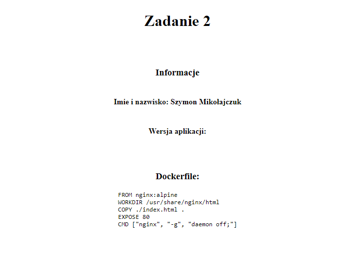

### Zawartość pliku dockerfile obrazu aplikacji:
```Dockerfile
FROM nginx:alpine 
WORKDIR /usr/share/nginx/html
COPY ./index.html .
EXPOSE 80
CMD ["nginx", "-g", "daemon off;"]
```

## Krok 1B

### Zawartość pliku deployment.yaml
```yaml
apiVersion: apps/v1
kind: Deployment
metadata:
  name: app
spec:
  replicas: 4
  selector:
    matchLabels:
      app: app
  template:
    metadata:
      labels:
        app: app
    spec:
      containers:
        - name: app
          image: szymonmik/zad2-img:7514750820
          imagePullPolicy: IfNotPresent
          env:
            - name: VERSION
              value: "7514750820"
          ports:
            - name: http
              containerPort: 80
              protocol: TCP
          resources:
            limits:
              memory: 250Mi
              cpu: 250m
            requests:
              memory: 150Mi
              cpu: 150m
  strategy:
    type: RollingUpdate
    rollingUpdate:
      maxSurge: 5
      maxUnavailable: 2
```

### Zawartość pliku service.yaml
```yaml
apiVersion: v1
kind: Service
metadata:
  name: app
spec:
  selector:
    app: app
  ports:
    - name: http
      protocol: TCP
      port: 80
      targetPort: 80
  type: NodePort
```

### Zawartość pliku ingress.yaml
```yaml
apiVersion: networking.k8s.io/v1
kind: Ingress
metadata:
  name: app
  annotations:
    kubernetes.io/ingress.class: "nginx"
spec:
  rules:
    - host: zad2.lab
      http:
        paths:
          - path: /
            pathType: Prefix
            backend:
              service:
                name: app
                port:
                  number: 80
```

## Krok 2:
### Zawartość pliku zad2lab10.yaml
```yaml
name: Docker CI

on: workflow_dispatch

jobs:
  dockerCI:
    name: dockerCI
    runs-on: ubuntu-latest
    steps:
      - name: Set Run ID to Variable
        run: echo "NEW_VERSION=${{ github.run_id }}" >> $GITHUB_ENV

      - name: Check out repo
        uses: actions/checkout@v4
      
      - name: Qemu installation
        uses: docker/setup-qemu-action@v3
        
      - name: Installation of Buildx image building engine
        uses: docker/setup-buildx-action@v3

      - name: Replace version in HTML
        run: sed -i 's|<p id="appVersion">.*<\/p>|<p id="appVersion">'"${NEW_VERSION}"'<\/p>|' index.html

      - name: Login to Docker Hub
        uses: docker/login-action@v3
        with:
          username: ${{ secrets.DOCKERHUB_USERNAME }}
          password: ${{ secrets.DOCKERHUB_TOKEN }}

      - name: Build and push Docker image
        uses: docker/build-push-action@v5
        with:
          context: ./
          push: true
          tags: szymonmik/zad2-img:${{ env.NEW_VERSION }}
          platforms: linux/amd64,linux/arm64
          
  kubernetesCI:
    name: kubernetesCI
    needs: dockerCI
    runs-on: ubuntu-latest
    steps:
      - name: Set Run ID to Variable
        run: echo "NEW_VERSION=${{ github.run_id }}" >> $GITHUB_ENV
      - name: Check out config-repo
        uses: actions/checkout@master
        with:
          repository: szymonmik/config-repo
          token: ${{ secrets.PAT_GITHUB }}
          
      - name: Edit deployment
        run: |
          git config --global user.name "ci"
          git config --global user.email "ci@ci.ci"
          yq -i '.spec.template.spec.containers[0].image |= "szymonmik/zad2-img:" + strenv(NEW_VERSION)' deployment.yaml
          yq -i '.spec.template.spec.containers[0].env[0].value = strenv(NEW_VERSION)' deployment.yaml
          git add deployment.yaml
          git commit -m "update deployment"
          git push origin main
```

### Potwierdzenie działania workflow

#### Akcje w Github Actions

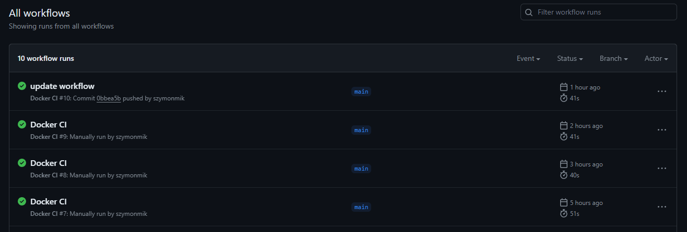

#### Widok przykładowego workflow

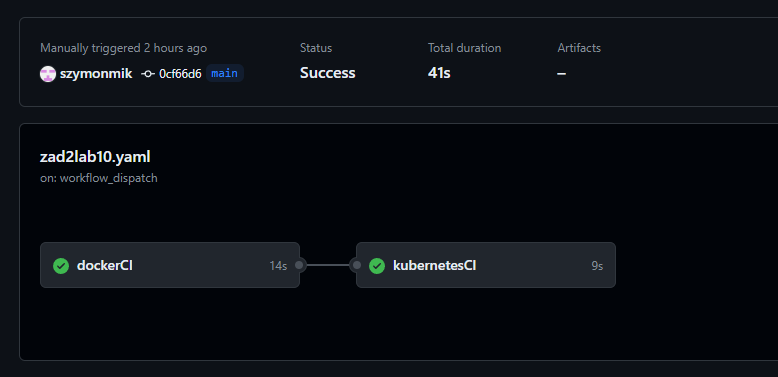

#### Po wykonaniu workflow na Docker Hub dodawane są kolejne wersje obrazu

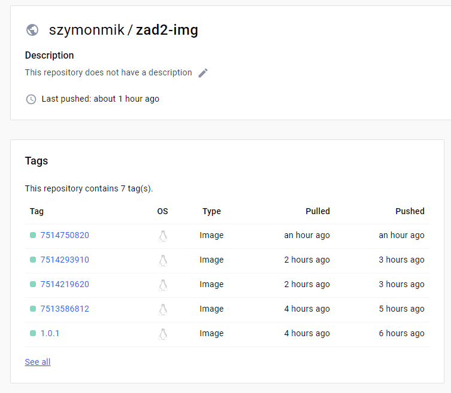

## Krok 3A:

### Zawartość pliku dockerfile
```dockerfile
FROM alpine
RUN apk add --no-cache git curl && \
  apk add --no-cache --repository=http://dl-cdn.alpinelinux.org/alpine/edge/community kubectl

CMD ["/bin/sh"]
```

## Krok 3B:

### Zawartość pliku stepCD
```yaml
apiVersion: batch/v1
kind: CronJob
metadata:
  name: step-cd
spec:
  schedule: "*/2 * * * *"
  concurrencyPolicy: Forbid
  jobTemplate:
    spec:
      template:
        spec:
          containers:
            - name: step-cd
              image: szymonmik/zad2gitops:latest
              command: [sh, -e, -c]
              args:
                - git clone https://github.com/szymonmik/config-repo.git /tmp/config-repo &&
                  sleep 10 &&
                  cd tmp/config-repo &&
                  kubectl apply -f deployment.yaml &&
                  kubectl apply -f service.yaml &&
                  kubectl apply -f ingress.yaml
          restartPolicy: Never
          serviceAccountName: gitops
      backoffLimit: 1
```

## Krok 4A:

#### Strona internetowa po uruchomieniu systemu

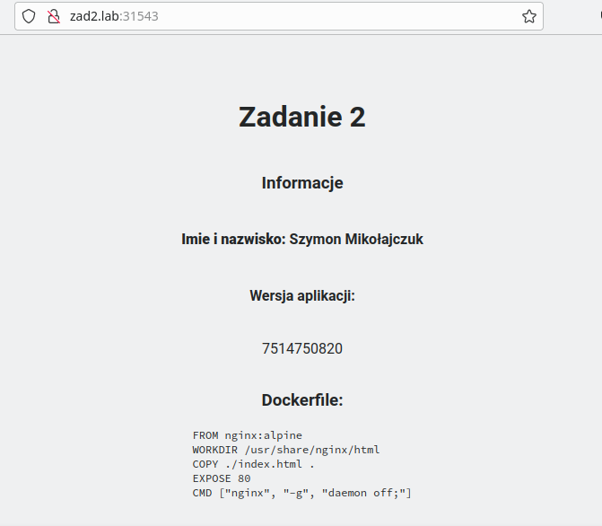

#### Wywołany workflow

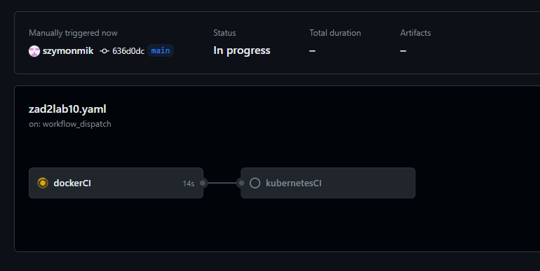

#### Pomyślnie ukończony workflow

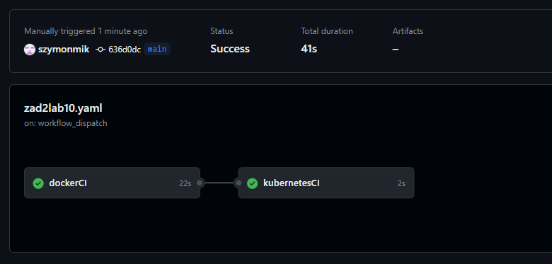

#### Potwierdzenie wysłania nowej wersji obrazu do repozytorium Docker Hub

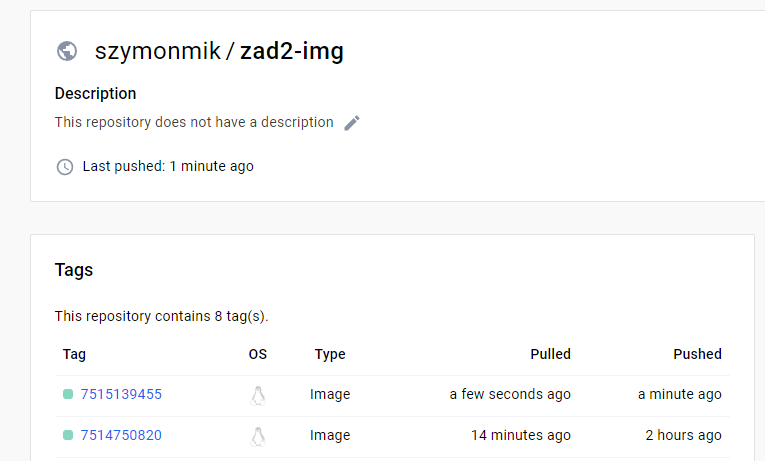

#### Widok konsoli po użyciu kubectl get all

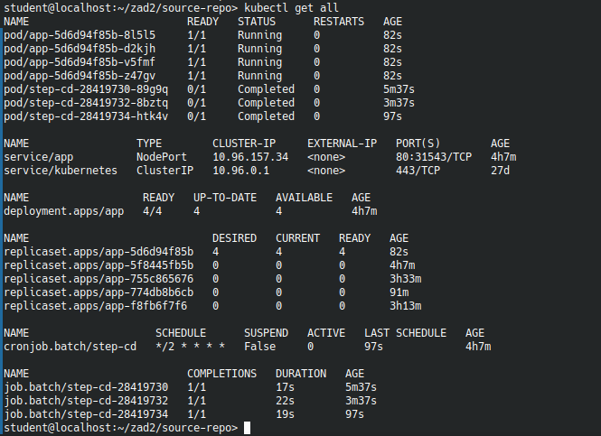

#### Potwierdzenie automatycznego zauktualizowania wersji w pliku index.html

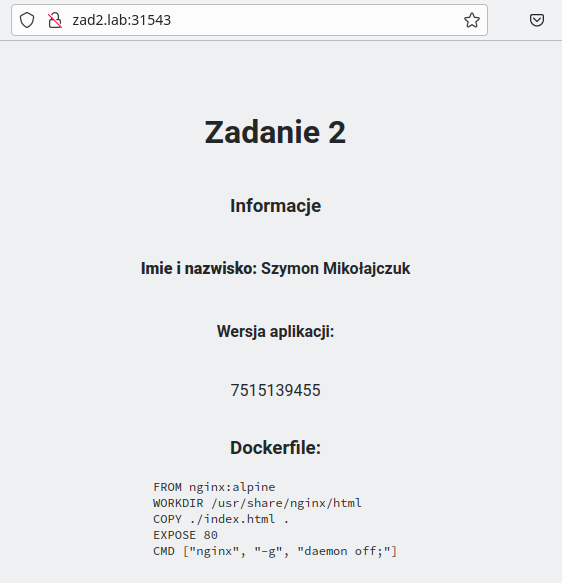

#### Potwierdzenie automatycznego commita w repozytorium config-repo w celu zaktualizowania wersji obrazu

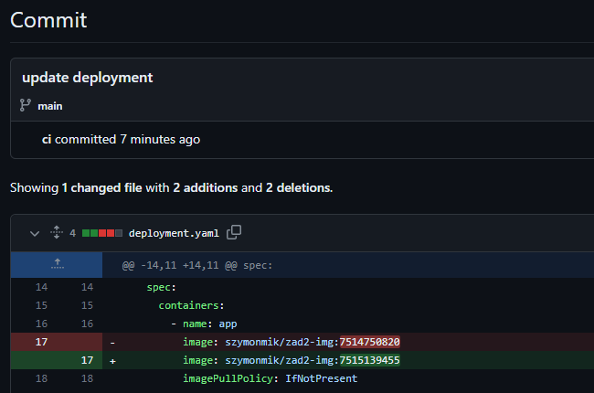
